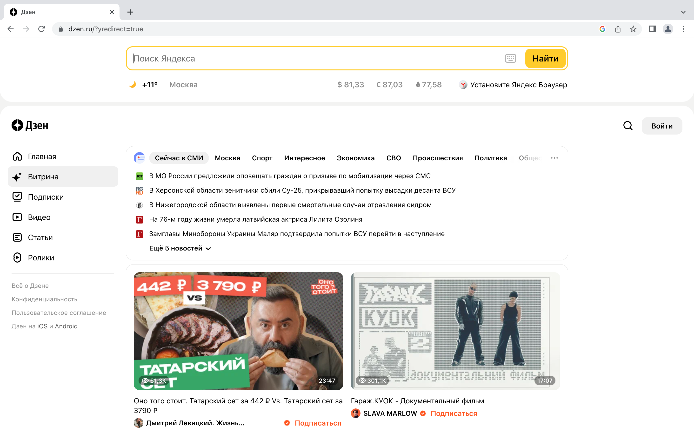

# HomeWork-Lesson-1-WebTech

HOMEWORK for Lesson 1. Web Technologies: Yesterday, Today, Tomorrow

Задача: на основе сайта yandex.ru:
- Определите, на каком протоколе работает сайт.

**Ответ:** Сайт работает по протоколу HTTPS. (https://dzen.ru/?yredirect=true)

- Проанализируйте структуру страницы сайта.

- Внесите не менее 10 изменений на страницу с помощью инструмента разработчика и представьте скриншоты было/стало.

Было: 
Стало: 

